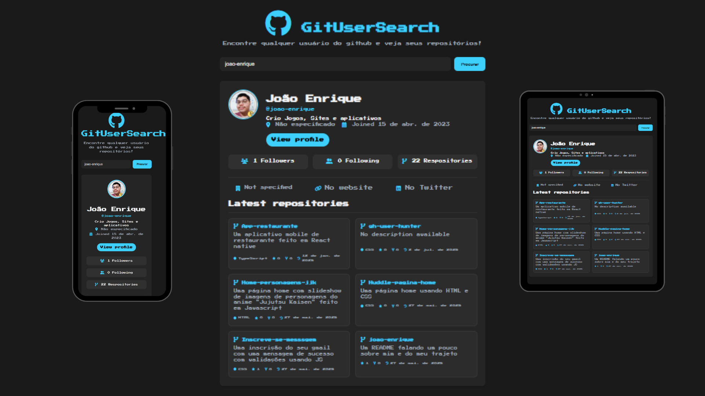

<h1 align="left">🚀 GitUserSearch</h1>

###

Encontre qualquer usuário do GitHub de forma rápida e prática! 🔍

<a align="center" href="https://joao-enrique.github.io/GitUserSearch/">Confira o projeto aqui!</a>

###

<h1 align="left">✨ Sobre o projeto</h1>

###

GitUserSearch é uma aplicação web desenvolvida para facilitar a busca por perfis de usuários no GitHub. Basta digitar o nome de usuário e você terá acesso às principais informações públicas, como foto de perfil, bio, repositórios e muito mais.

###

<h1 align="left">🛠 Tecnologias usadas</h1>

###

  
  
  
  
  
  
  

###

HTML  CSS  JavaScript  GitHub REST API

###

<h1 align="left">⚙️ Funcionalidades</h1>

###

Buscar qualquer usuário cadastrado no GitHub  Exibir avatar, bio, número de repositórios, seguidores e seguindo  Interface limpa e responsiva

###

<h1 align="left">📸 Preview</h1>

###

  

###

<h1 align="left">✅ Contribuições</h1>

###

Contribuições são bem-vindas! Sinta-se livre para abrir issues ou enviar pull requests.

###